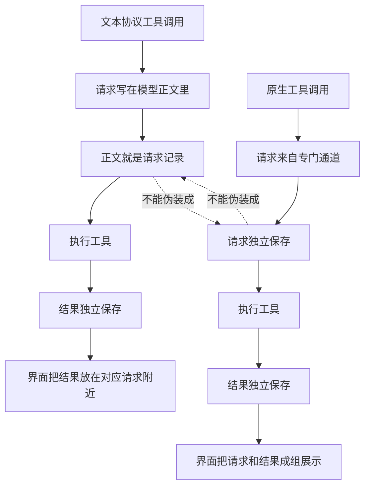

# 两种工具调用的记录与展示机制

## 目标

我们需要同时支持两种工具调用方式：

- 文本协议工具调用：模型把工具请求写在自己回复的文字里。
- 原生工具调用：模型通过专门通道发起工具请求，而不是写在回复文字里。

这两种方式都能触发工具执行，也都会产生工具结果。但它们的来源不同，所以记录方式不能混用。

核心原则是：来源决定记录位置，结果保持独立，界面只负责把有关联的内容放近一点。

## 总体规则

文本协议工具调用是“正文里的请求 + 独立的结果”。

原生工具调用是“独立的请求 + 独立的结果”。

两者共享工具执行这件事，但不共享“请求本身怎么记录”的规则。

## 文本协议工具调用

文本协议工具调用的请求本体，是模型回复里真实出现的那段工具请求文字。

这段文字必须留在模型正文原来的位置。它不能被删除、搬走、复制成另一份工具请求，也不能被改造成原生工具调用那种记录。

执行过程中可以临时读懂这段文字，然后执行工具。但“读懂它”只是为了完成当前动作，不等于要把它另存成一个新的请求记录。

工具执行完成后，工具结果要独立保存。结果不是模型正文，不能塞进模型正文里，也不能看起来像模型自己写出来的回答。

界面展示时，先正常显示模型正文。遇到正文里的工具请求文字时，再把对应工具结果显示在它附近。这里的“附近”只是界面摆放关系，不是把结果写进正文。

## 原生工具调用

原生工具调用的请求本体，不在模型正文里。

它来自模型的专门通道，所以必须作为独立请求保存。否则会话记录里就没有地方能真实表达“模型发起过这个工具请求”。

工具执行完成后，工具结果同样独立保存。

界面展示时，原生工具调用可以把“独立请求”和“独立结果”放成一组。它们都不是模型正文，所以不应该伪装成模型正文。

## 两者差别

| 对比点 | 文本协议工具调用 | 原生工具调用 |
| --- | --- | --- |
| 请求从哪里来 | 模型回复文字 | 模型专门通道 |
| 请求怎么记录 | 留在模型正文里 | 独立保存 |
| 结果怎么记录 | 独立保存 | 独立保存 |
| 界面怎么展示 | 正文显示请求，结果贴近对应请求 | 请求和结果成组展示 |
| 能否互相转换 | 不能转成原生请求记录 | 不能伪装成正文文字 |

## 展示规则

界面展示不是改变真实记录，只是把已经有关联的内容摆在一起。

文本协议工具调用展示时，模型正文仍然是主线。工具结果是旁边或下方的辅助信息，必须明确看得出它是工具结果，不是模型正文。

原生工具调用展示时，独立请求和工具结果可以作为一组展示，因为它们本来就都不是模型正文。

## 历史上下文规则

继续对话时，模型应该能理解之前发生过什么。

文本协议工具调用的历史，应该表达为：模型当时写过这段工具请求文字，工具后来返回了这个结果。

原生工具调用的历史，应该表达为：模型当时通过专门通道发起过这个工具请求，工具后来返回了这个结果。

两边都要保留真实历史，但真实历史的形态不同。

## 修改纪律

不要为了显示方便，改变真实记录。

不要把文本协议工具调用另存成原生工具调用式的请求记录。

不要把工具结果塞进模型正文。

不要把原生工具调用伪装成模型正文。

如果未来要改变任意一条记录规则，必须先确认这是新的设计决定，而不是把它当作普通实现细节顺手修改。
