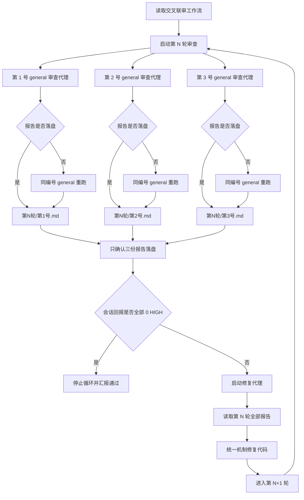

# eucli-box 客户端交叉联审工作流

本文档用于固定调度者的工作模式。以后用户要求继续交叉联审、继续修复、继续下一轮时，调度者先阅读本文档，再按本文档执行。

## 一、角色边界

### 调度者

调度者只负责协调循环，不直接替代审查代理或修复代理做判断。

调度者职责：

- 启动指定轮次的审查代理。
- 给每个审查代理分配唯一编号。
- 确认每个审查代理的报告文件是否落盘。
- 只确认指定轮次的 3 份审查报告是否齐全，不读取审查报告正文。
- 审查报告不齐全时，补跑缺失编号的审查代理。
- 审查报告齐全后，直接启动修复代理。
- 修复完成后进入下一轮联审。
- 如果审查代理在会话回报 0 HIGH，且本轮 3 份报告都已落盘，停止循环。

调度者不得：

- 在启动审查代理时重复粘贴大段审查规则。
- 替审查代理写审查报告。
- 替修复代理扩大修复范围。
- 在报告缺失时直接进入修复或下一轮。
- 打开审查报告正文来代替子代理判断。

### 审查代理

审查代理是独立代码审查员。每个审查代理只代表自己。

调度者启动审查代理时，只提供：

- 当前是第几轮。
- 该代理是第几号。
- 要求读取 `.code-review-prompt.txt` 并执行。

推荐启动语句：

```text
现在是第N轮，你是第M号审查代理。请阅读 .code-review-prompt.txt 并执行。
```

审查代理必须把报告写入：

```text
.task\交叉联审报告\第N轮\第M号.md
```

审查代理不得在会话里粘贴报告正文，只能简短回报 HIGH 数量和报告路径。

审查代理固定使用 `general` 子代理。不要使用 `explore` 执行交叉联审，因为交叉联审要求稳定写入 Markdown 报告。

启动时使用同一条最小启动语句，不额外粘贴审查规则：

```text
现在是第N轮，你是第M号审查代理。请阅读 .code-review-prompt.txt 并执行。
```

### 修复代理

修复代理是代码修复实施者。

调度者启动修复代理时，只提供：

- 当前要修复第几轮联审报告。
- 要求读取 `.code-fix-prompt.txt` 并执行。

推荐启动语句：

```text
现在修复第N轮联审报告指出的问题。请阅读 .code-fix-prompt.txt 并执行。
```

修复代理必须读取：

```text
.task\交叉联审报告\第N轮\*.md
```

修复代理按所有报告中指出的问题进行统一修复，不得逐条打补丁。

## 二、固定文件

### 审查提示词

```text
.code-review-prompt.txt
```

用于告诉审查代理：

- 读哪些设计文档。
- 读哪些施工文档。
- 读哪些代码。
- 按哪些维度审查。
- 报告写到哪里。
- 如何根据轮次和编号生成报告文件。
- 如何在会话里简短回报 HIGH 数量和报告路径。

### 修复提示词

```text
.code-fix-prompt.txt
```

用于告诉修复代理：

- 读哪些设计文档。
- 读哪些施工文档。
- 读取哪一轮审查报告。
- 如何汇总 HIGH / MEDIUM / LOW。
- 如何按统一机制修复代码。
- 修复完成后如何说明验证结果。

### 报告目录

```text
.task\交叉联审报告\第N轮\第M号.md
```

每轮至少应有 3 份独立审查报告：

```text
.task\交叉联审报告\第N轮\第1号.md
.task\交叉联审报告\第N轮\第2号.md
.task\交叉联审报告\第N轮\第3号.md
```

## 三、循环流程

1. 启动第 N 轮 3 个独立审查代理。
2. 审查代理分别读取 `.code-review-prompt.txt`。
3. 审查代理分别写入第 N 轮第 1/2/3 号报告，并在会话里简短回报 HIGH 数量和报告路径。
4. 调度者只确认 3 个报告文件是否均已存在，不读取报告正文。
5. 如果报告不齐，补跑缺失编号的 general 审查代理。
6. 如果 3 个报告齐全，且 3 个审查代理均在会话回报 HIGH = 0，停止循环。
7. 如果 3 个报告齐全，但任一审查代理会话回报 HIGH > 0，启动修复代理修复第 N 轮问题。
8. 修复完成并确认修复报告落盘后，进入第 N+1 轮。

## 四、停止条件

停止条件是：同一轮次下 3 个审查代理均在会话回报 HIGH = 0，且 3 份审查报告全部落盘：

```text
第N轮第1号审查完成，HIGH：0，报告已写入：.task\交叉联审报告\第N轮\第1号.md
第N轮第2号审查完成，HIGH：0，报告已写入：.task\交叉联审报告\第N轮\第2号.md
第N轮第3号审查完成，HIGH：0，报告已写入：.task\交叉联审报告\第N轮\第3号.md
```

满足停止条件后：

- 不再启动修复代理。
- 不再启动下一轮审查代理。
- 不要求审查代理写额外分析文档。
- 调度者向用户汇报联审通过。

## 五、异常处理

### 报告缺失

如果某个审查代理回报完成，但对应报告文件不存在：

1. 不进入汇总。
2. 不启动修复代理。
3. 重新调用同一编号的 general 审查代理。
4. 仍使用相同轮次和相同编号。

### 报告路径错误

如果报告写到错误路径：

1. 不手动搬运报告。
2. 重新调用该编号审查代理。
3. 要求其按 `.code-review-prompt.txt` 的路径规则重新写入。

### 修复失败

如果修复代理无法完成修复：

1. 要求修复代理说明阻塞原因。
2. 不开启下一轮审查。
3. 先解决阻塞，再继续循环。

## 六、调度原则

- 调度者是流程协调者，不是审查者。
- 审查代理只读 `.code-review-prompt.txt`。
- 审查代理固定使用 general 子代理，不使用 explore。
- 修复代理只读 `.code-fix-prompt.txt`。
- 报告是轮次推进的证据，不允许口头替代。
- 调度者只确认报告文件是否齐全，不读取审查报告正文。
- 子代理会话回报的 HIGH 数量用于判断停止或继续修复。
- 3 个审查代理均回报 0 HIGH 且报告齐全，是唯一停止条件。
- 任一审查代理回报 HIGH > 0 且报告齐全，就启动修复；修复后必须复审。
- 同一根因必须统一修复，拒绝补丁式处理。
- 所有代码修复必须遵守根系涌现、客户端边界、快速失败和数据真源原则。

## 七、调度图


